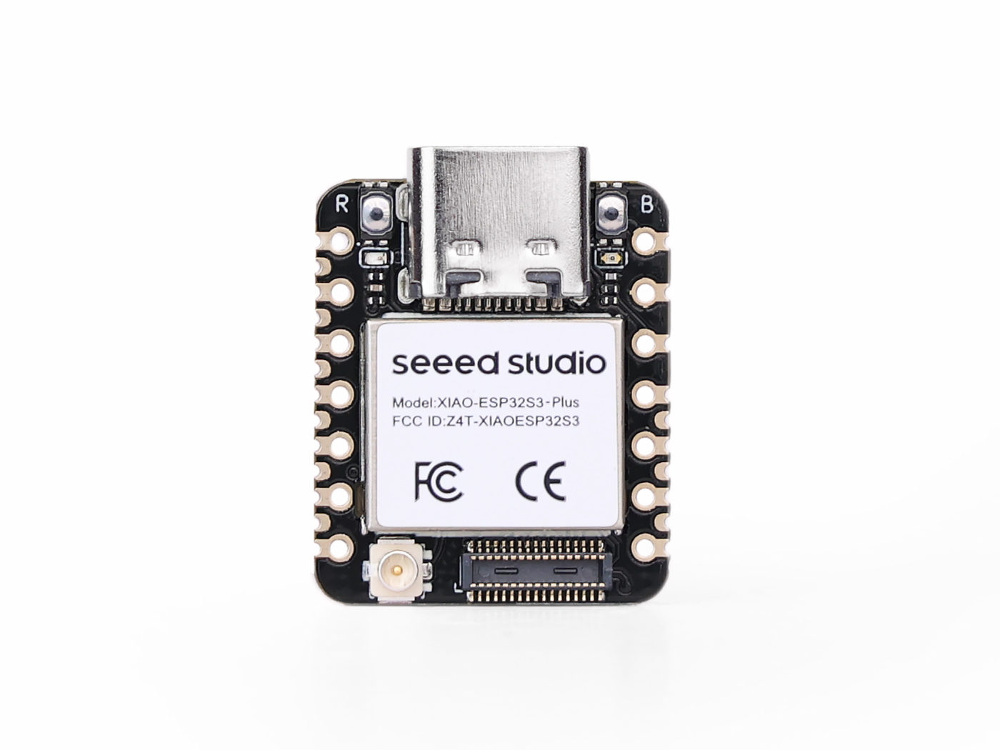
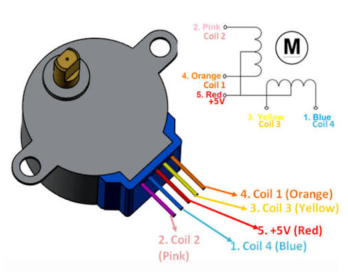

# Parts Used in the Project

<strong>XIAO ESP32-S3</strong>

The XIAO ESP32-S3 is the main microcontroller used in the project. It runs the program and controls the other components by reading inputs and sending output signals.

---

<strong>28BYJ-48 Stepper Motor</strong>

The 28BYJ-48 is a small stepper motor that can rotate in precise steps. It is used when controlled movement and positioning are needed.

---

<strong>L293 Motor Driver</strong>

The L293 is a motor driver used between the ESP32 and the stepper motor. It allows the microcontroller to control the motor while providing the higher current required by the motor.

---

<strong>4-Pin RGB LED</strong>

The RGB LED contains red, green, and blue LEDs in one package. By controlling each color individually, it can display different colors and provide visual feedback about the system.

---

<strong>Push Buttons</strong>

Two push buttons are used as user inputs. When pressed, they send a signal to the ESP32 so the program can perform a specific action.

# How These Parts Were Connected

Connections:

| Component | Connected To |
|---|---|
| XIAO GPIO1–4 | L293D inputs (1A, 2A, 3A, 4A) |
| L293D outputs (1Y, 2Y, 3Y, 4Y) | Stepper motor coils (Orange, Pink, Yellow, Blue) |
| Motor red wire | +5V |
| L293D Pin 16 (VCC1) | +3.3V (logic power) |
| L293D Pin 8 (VCC2) | +5V (motor power) |
| L293D Pins 1 & 9 (EN) | +3.3V (enables motor channels) |
| L293D Pins 4, 5, 12, 13 | GND |
| XIAO GPIO7 | Red LED (through 220Ω resistor) |
| XIAO GPIO8 | Blue LED (through 220Ω resistor) |
| XIAO GPIO9 | Green LED (through 220Ω resistor) |
| XIAO GPIO5 | Button 1 |
| XIAO GPIO6 | Button 2 |
| All GND pins | Common ground |
| Stepper motor shaft | Popsicle stick (clock hand) |