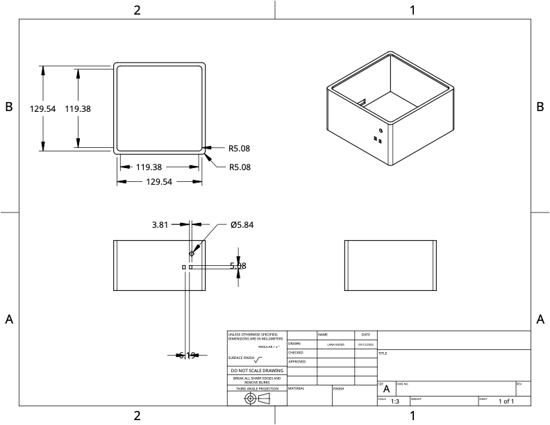
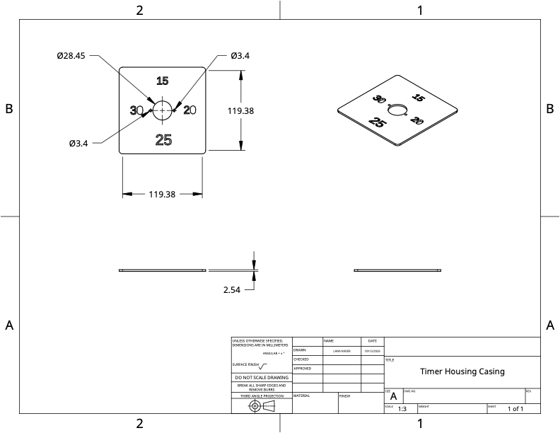

# Mechanical Design

The mechanical portion of the project focuses mainly on the design and construction of the enclosure that holds and supports the electrical components.

The enclosure was designed in CAD as a simple box with a removable top. Its purpose is to keep the breadboard and wiring contained while also providing mounting points and openings for the components that need to be accessible from the outside.

## Enclosure Design

The main body of the enclosure is designed to hold the breadboard and the majority of the wiring used in the project.

Several openings were added to the enclosure so that the electrical components can be accessed without needing to open the box.

These include:

* Holes for the push buttons
* An opening for the RGB LED
* Space inside the enclosure for the breadboard and wiring
* Openings needed to route or position electrical components

The buttons are positioned so that they can be pressed from outside the enclosure while still remaining connected to the breadboard inside.

The RGB LED is also mounted through the enclosure so that its light can be clearly seen while the rest of the electrical hardware remains protected inside.

## Top Cover

The top cover of the enclosure was designed to support the stepper motor used in the project.

A hole in the cover allows the motor shaft to extend through the top of the enclosure. There is also two holes in which two screws and nuts can be connected through the motor to safely attach to the top. A pointer, or stick, is attached to the motor shaft and rotates with the motor.

The pointer is used to indicate different positions marked on the top surface of the enclosure. As the stepper motor rotates to specific angles, the pointer moves to the corresponding position.

This allows the motion of the motor to be turned into a simple visual display while keeping the motor and electrical connections mostly contained inside the enclosure.

## CAD Drawings

The CAD drawings in this folder document the dimensions and geometry of the enclosure and its individual parts.

<strong>Main Box Enclosure Drawing</strong>

<strong>Top of Box Drawing</strong>

The design consists mainly of:

* The main enclosure body
* The removable top cover
* Button mounting holes
* RGB LED opening
* Stepper motor shaft opening
* Space for the internal breadboard and wiring

These drawings can be used to reproduce or modify the enclosure if changes to the project are needed later.

