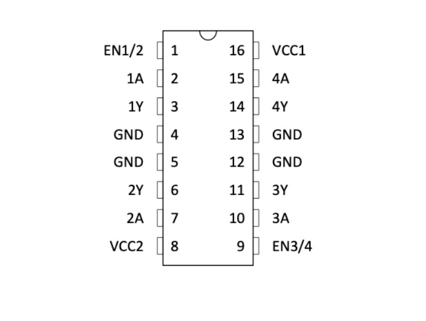
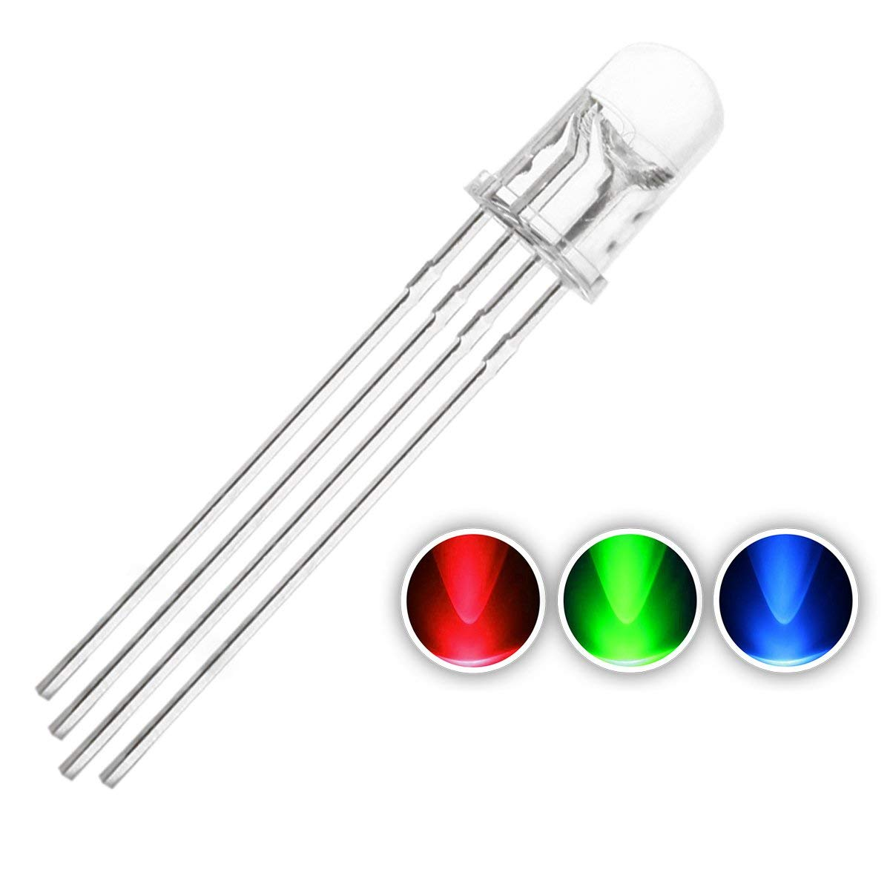

# Parts Used in the Project 
 

 

  XIAO-ESP32-S3

--- 
  

 

  28BY J-48 Stepper Motor

---
  

 

  L293 Driver

---
  

  RGB 4 pin light

---
  

 

  2 buttons

# How These Parts Were Used

How These Parts Were Used

The XIAO ESP32-S3 microcontroller runs the MicroPython code that controls the whole device. It drives a stepper motor (through an L293D H-bridge driver, since the motor needs more power than the microcontroller can supply directly) to rotate a clock hand showing time remaining, lights three PWM-driven LEDs for status feedback, and reads two buttons for user input.

Connections:

| Component | Connected To |
|---|---|
| XIAO GPIO1–4 | L293D inputs (1A, 2A, 3A, 4A) |
| L293D outputs (1Y, 2Y, 3Y, 4Y) | Stepper motor coils (Orange, Pink, Yellow, Blue) |
| Motor red wire | +5V |
| L293D Pin 16 (VCC1) | +3.3V (logic power) |
| L293D Pin 8 (VCC2) | +5V (motor power) |
| L293D Pins 1 & 9 (EN) | +3.3V (enables motor channels) |
| L293D Pins 4, 5, 12, 13 | GND |
| XIAO GPIO7 | Red LED (through 220Ω resistor) |
| XIAO GPIO8 | Blue LED (through 220Ω resistor) |
| XIAO GPIO9 | Green LED (through 220Ω resistor) |
| XIAO GPIO5 | Button 1 |
| XIAO GPIO6 | Button 2 |
| All GND pins | Common ground |
| Stepper motor shaft | Popsicle stick (clock hand) |