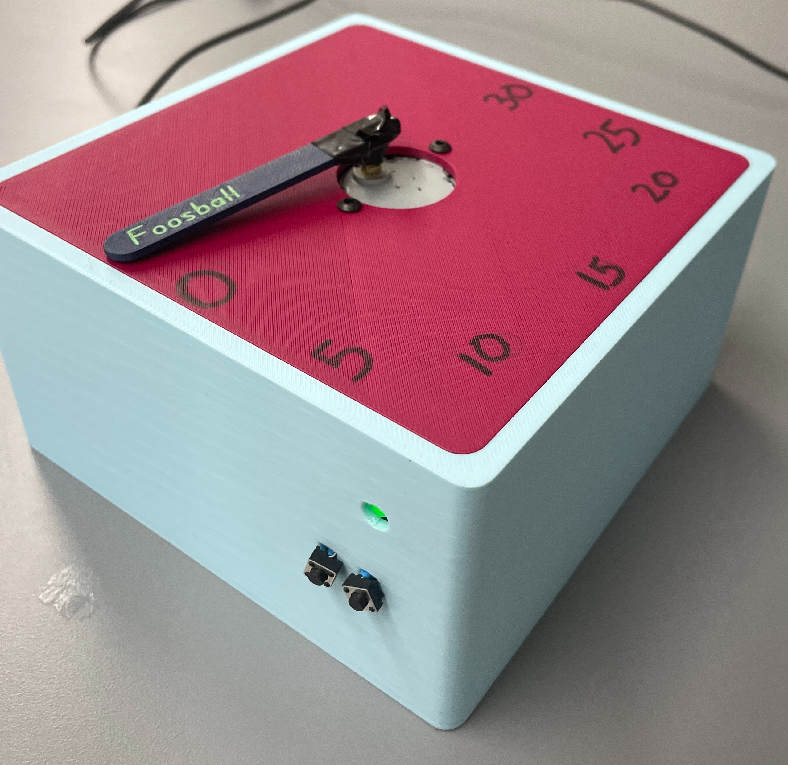
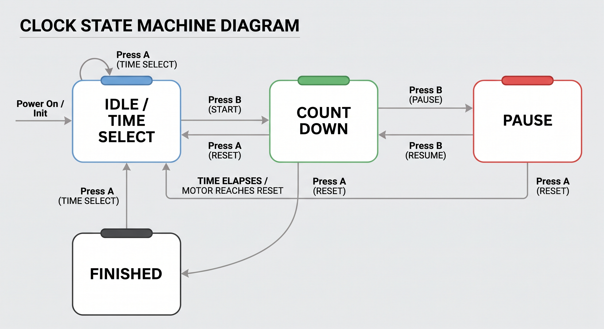
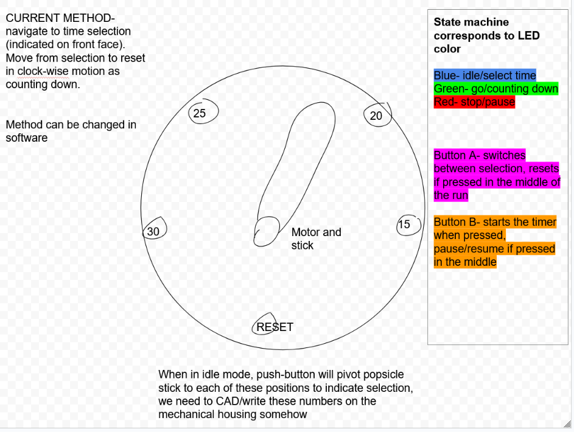

# 07-Miniproject
[Project Board Link (responsibilities listed here)](https://app.notion.com/p/Mini-Project-Board-3da2b21b7a02809690e9f732688cc1ad?source=copy_link)
## Repository Structure

```
.
├── firmware/                # Micro source code
├── Hardware/
│   ├── Electrical/          # Schematics, wiring diagrams, and component docs
│   └── Mechanical/          # Enclosure CAD/STL files and drawings
├── photos/                  # All project images (schematics, CAD drawings, product photos, etc.)
└── README.md
```

## Product Photo

<p align="center">
  
</p>

## Flow Chart & Electrical Schematic

<p align="center">
  
  
</p>

## Approach & Progress

After setting up the team repo with a branch protection ruleset for `main`, development started on the breadboard circuitry needed to interface with the embedded hardware alongside the software prototype.

This was built up one step at a time:

1. Verified the ESP32-S3 could be flashed via Thonny MicroPython with a simple blink test on the onboard LED.
2. Wired the necessary GPIO pins to the motor controller, including grounding, supplying voltage, and tying the enable pins high, then connected the motor to the controller.
3. Tested with a simple script that spun the motor 90° back and forth based on its gear ratio.
4. Attached the push buttons to additional I/O and continuously ran the motor until a button press was detected (with software debouncing) — one button reverses direction, the other pauses/resumes motion.
5. Connected 3 GPIO pins to each RGB LED anode prong (through resistors) and grounded the cathode, then drove PWM signals to the GPIO pins to experiment with flashing frequencies.
6. Implemented the finite state machine for operation — the core of the project. With all other embedded components functioning, wiring up the clock-specific use case was trivial beyond the state machine itself.

The software/embedded prototype now exists, and the rest of the team can carry it forward to the final version.

### Design Intentionality and Tradeoffs

| State | LED | Button A | Button B |
|---|---|---|---|
| Idle / Time Select | Blue | Time select | Start |
| Count Down | Green | Reset | Pause |
| Pause | Red | Reset | Resume |

In the idle state, the pointer indicates the selected time in 360°/5 = 72° increments (requiring a clock face labeled at each position). Upon start, the pointer moves from the selected time position to the reset position. There are 5 total positions — 4 time options plus the reset position.

There are multiple ways to lay out these positions, and the tradeoff considered here is that total movement isn't proportional to the selected time (15 min is 72° from reset, 20 min is 144°, etc.), but functionally the user can still gauge the proportion of time that has passed since the timer started.

<p align="center">
  
</p>

**Update:** the final version changed this so the countdown is proportional. Even though only 15/20/25/30 are selectable times, the dial reserves the space for 5 and 10 minutes between each selection and the reset (0) position — so the pointer's distance from reset always reflects how much time is actually left, regardless of which time was selected.

## Team

| Role | Named Members |
|------|---------|
| Mechanical Housing | Lana Kader, Niyati Patel, Arham Mufti |
| Electrical Wiring | Lana Kader, Mason Pfeiffer, Ethan Manfredi |
| uController Firmware | Darwin Quizhpi, Phillip Omohundro, Mason Pfeiffer, Ethan Manfredi |

[Project Board Link (responsibilities listed here)](https://app.notion.com/p/Mini-Project-Board-3da2b21b7a02809690e9f732688cc1ad?source=copy_link)